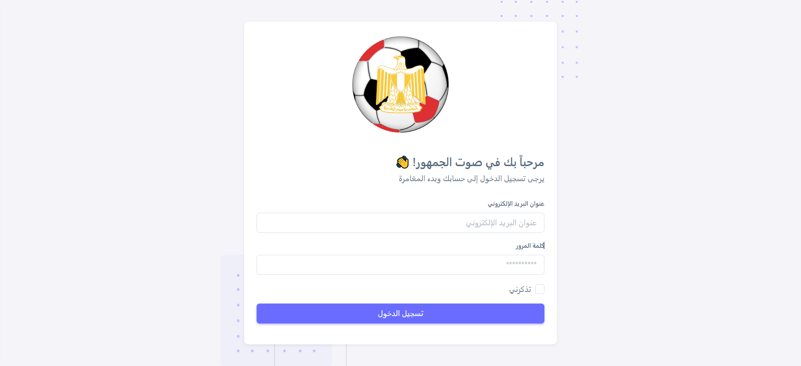
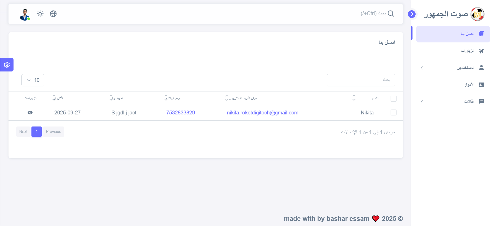
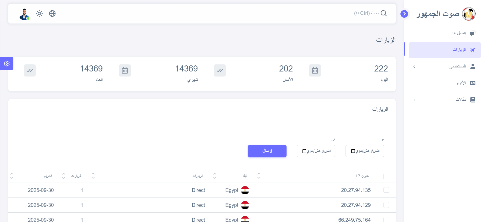
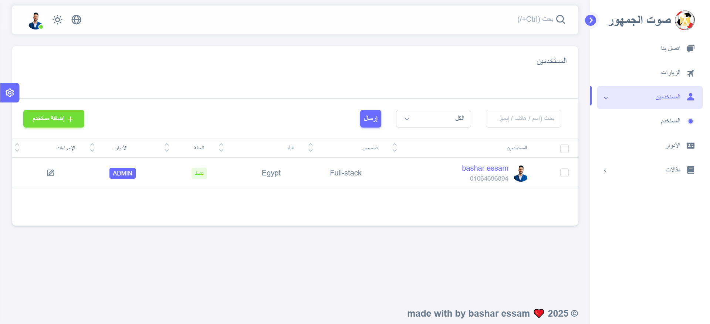
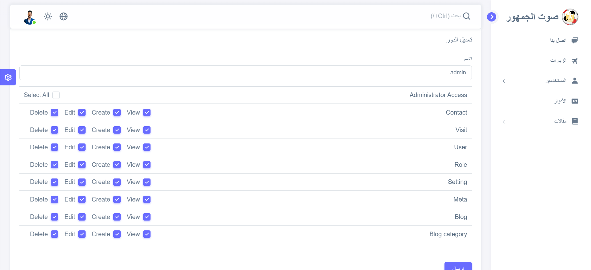
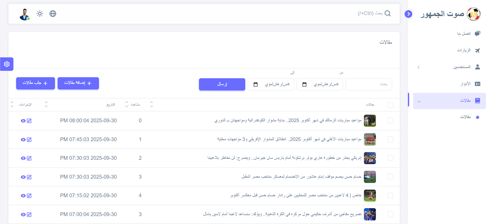
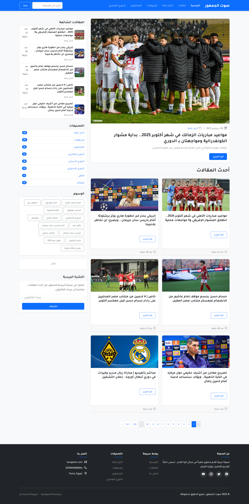
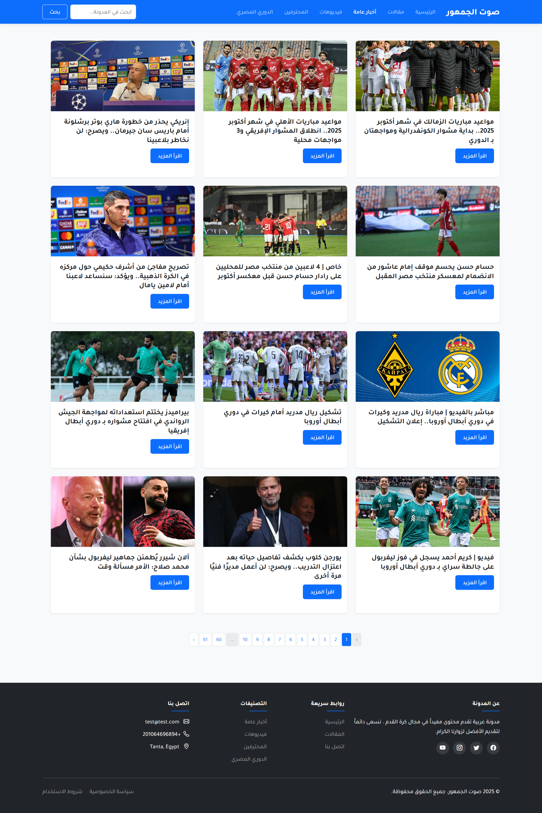
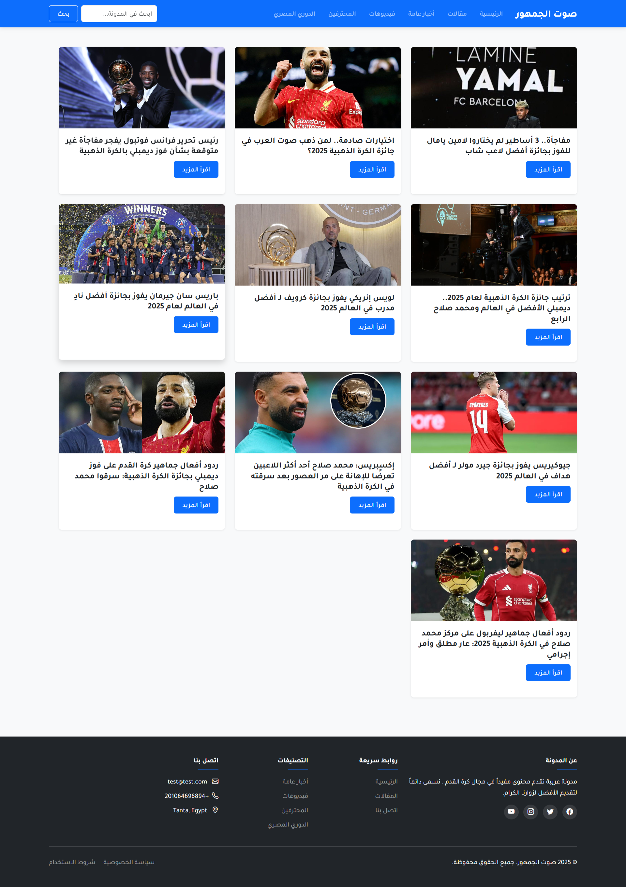
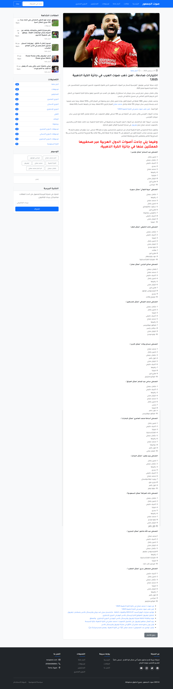

# مشروع المدونة ولوحة التحكم

هذا المشروع عبارة عن **مدونة متكاملة مع لوحة تحكم**.  
تتيح لوحة التحكم إدارة المقالات والمستخدمين والأدوار بسهولة، بالإضافة إلى ميزة **جلب المقالات تلقائيًا من مواقع أخرى** لعرضها في الموقع دون الحاجة لإدخالها يدويًا.  
المشروع يدعم **RTL** ويوفر واجهة منظمة وسهلة الاستخدام.

---

## ميزات المشروع

- إدارة المقالات وإضافة مقالات جديدة وتعديلها وحذفها.
- جلب المقالات تلقائيًا من مواقع أخرى وعرضها على المدونة.
- إدارة المستخدمين وأدوارهم وصلاحياتهم داخل لوحة التحكم.
- متابعة الزيارات والرسائل الواردة من المستخدمين.
- واجهة لوحة تحكم حديثة ومنظمة مع قائمة جانبية قابلة للتوسع.

---

## قائمة لوحة التحكم الجانبية

### 1. تسجيل الدخول

- **نبذة:** صفحة تسجيل الدخول للوصول إلى لوحة التحكم، مع التحقق من بيانات المستخدم لضمان الأمان.  
- **صورة توضيحية:**  
    

---

### 2. اتصل بنا

- **نبذة:** مراجعة رسائل التواصل الواردة من المستخدمين والزوار والرد عليها عند الحاجة.  
- **صورة توضيحية:**  
    

---

### 3. الزيارات

- **نبذة:** عرض جميع الزيارات للموقع وتتبع نشاط المستخدمين أو مواعيد الزيارات الميدانية.  
- **صورة توضيحية:**  
    

---

### 4. المستخدمين

- **نبذة:** إدارة حسابات المستخدمين، إضافة مستخدمين جدد، تعديل بياناتهم أو حذفهم.  
- **صورة توضيحية:**  
    

#### 5 الأدوار

- **نبذة:** إدارة أدوار المستخدمين وصلاحياتهم لضمان الأمن والتنظيم داخل لوحة التحكم.  
- **صورة توضيحية:**  
    

---

### 6 مقالات

- **نبذة:** إدارة المقالات، إضافة مقالات جديدة، تعديل المقالات القديمة أو حذفها.  
- **صورة توضيحية:**  
    

---

### 6. الصفحة الرئيسية

 - **صورة توضيحية:**  
    

#### 6.1 الانواع

 - **صورة توضيحية:**  
    

#### 6.1 التصنيفات

 - **صورة توضيحية:**  
    

---

#### 6.1 عرض المقالة

 - **صورة توضيحية:**  
    

---

## كيفية الاستخدام

1. تسجيل الدخول إلى لوحة التحكم.
2. إدارة المقالات، المستخدمين، والأدوار من القائمة الجانبية.
3. جلب المقالات تلقائيًا من المواقع المحددة لتظهر مباشرة على المدونة.
4. متابعة الرسائل والزيارات اليومية لمراقبة نشاط المستخدمين.

---

## ملاحظات

- جميع الصور في README يمكن استبدالها بالمسار الفعلي للصور في المشروع.
- المشروع يدعم **Right-to-Left (RTL)** للغات العربية.
- يُنصح بتحديث قائمة المواقع لجلب المقالات بشكل دوري لضمان عرض محتوى حديث.
